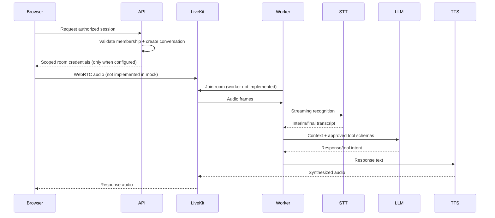

# Intended voice event flow

```mermaid
sequenceDiagram
 participant Browser
 participant API
 participant LiveKit
 participant Worker
 participant STT
 participant LLM
 participant TTS
 Browser->>API: Request authorized session
 API->>API: Validate membership + create conversation
 API-->>Browser: Scoped room credentials (only when configured)
 Browser->>LiveKit: WebRTC audio (not implemented in mock)
 Worker->>LiveKit: Join room (worker not implemented)
 LiveKit->>Worker: Audio frames
 Worker->>STT: Streaming recognition
 STT-->>Worker: Interim/final transcript
 Worker->>LLM: Context + approved tool schemas
 LLM-->>Worker: Response/tool intent
 Worker->>TTS: Response text
 TTS-->>LiveKit: Synthesized audio
 LiveKit-->>Browser: Response audio
```
